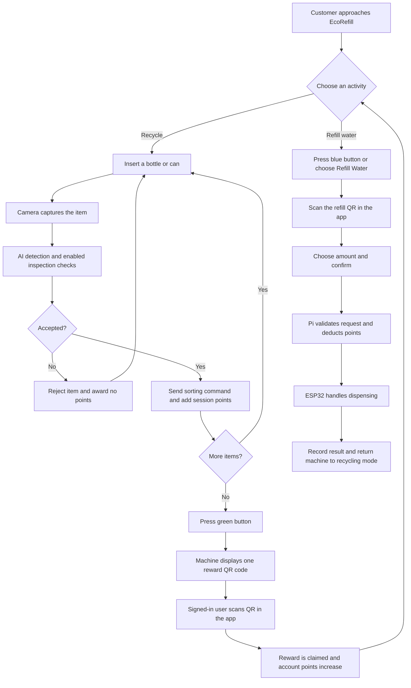
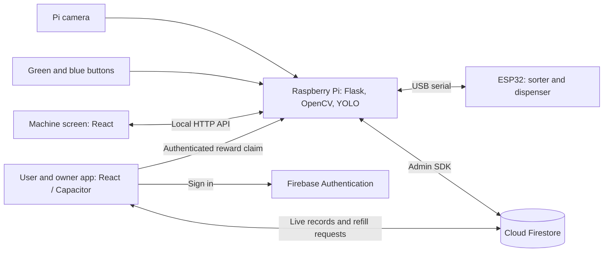

# EcoRefill

**Recycle bottles and cans. Earn EcoPoints. Use them for water refills.**

EcoRefill is a recycling and water refill machine connected to a web and Android app. It uses a camera and an AI object detection model to recognize plastic bottles and aluminum cans, sends sorting commands to a hardware controller, and rewards accepted items with EcoPoints. Users collect their rewards by scanning a QR code and spend their saved points on water from the machine.

The project brings together a Raspberry Pi, an ESP32 controller, a machine display, a user app, and an owner dashboard. Its purpose is to encourage recycling by connecting recyclable collection with a useful everyday reward: water refills.

This README describes the implementation in this repository. Hardware behavior depends on the connected machine and its ESP32 firmware; current implementation gaps are listed below.

## What the system includes

| Part | Purpose |
| --- | --- |
| Recycling machine | Receives items one at a time, captures images, identifies supported materials, and sends sorting commands. |
| Water dispenser | Receives commands for a selected refill amount through the ESP32. |
| Machine screen | Shows scanning progress, accepted or rejected results, session totals, reward QR codes, and refill status. |
| User app | Provides registration, login, QR scanning, point balances, refill selection, owner-verified GCash point purchases, and transaction history. |
| Device owner dashboard | Shows the assigned machine, recycling statistics, recent scan photos, transactions, alerts, and reported machine readings. |
| Firebase | Stores accounts, points, recycling records, reward codes, refill sessions, and transactions. |

## Overall system flow



## Recycling: from an item to EcoPoints

1. **Prepare the items.** Bring clean, empty plastic bottles or aluminum cans and insert them one at a time.
2. **Automatic detection starts.** The Pi uses camera motion detection to notice an item and waits for a stable view before capturing it. No start button is needed.
3. **The model checks the item.** YOLO predicts its class. The machine accepts configured material classes only when the prediction passes its confidence and object-area thresholds. Optional visual inspection can add further checks.
4. **The machine sorts or rejects it.** The Pi sends `BOTTLE`, `CAN`, or `REJECT` to the ESP32. Rejected items earn no points.
5. **Accepted items build one session total.** Each accepted bottle or can adds **1 EcoPoint**. The screen shows the item count and points. The user can continue inserting items.
6. **The user presses the green button.** The machine creates one reward for the entire batch and displays a QR code. Account points are credited when that code is successfully claimed.
7. **The user claims the reward.** A signed-in user opens the app's scanner and scans the QR. The redemption service verifies the Firebase login token and reward availability, then updates the balance and records a transaction.
8. **The session ends.** A claimed reward cannot be claimed again. Unclaimed reward codes have a **60-second** validity period, after which the machine prepares for another customer.

For example, three accepted plastic bottles and two accepted aluminum cans produce one reward QR worth **5 EcoPoints**.

### Accepted materials and inspection

| Detected class | Category | Points per accepted item |
| --- | --- | --- |
| `plastic_bottle` or `pet_bottle` | Plastic bottle | 1 |
| `aluminum_can` or `aluminium_can` | Aluminum can | 1 |
| Unsupported, unknown, or insufficiently confident detection | Rejected | 0 |

The current detector uses an inference image size of **416**, an acceptance confidence threshold of **0.65**, and a minimum bounding-box area of **5%** of the camera frame. Confidence is a model score, not a guarantee of material identity or real-world accuracy. Generic class names such as `bottle` and `can` are not accepted by the material rules.

An optional inspection module supports approximate exterior size checks and a separate classifier for visible cleanliness. Its modes are:

- **`off`:** Optional checks do not change acceptance; sample collection can still be enabled.
- **`observe`:** Record inspection results without rejecting items based on those results.
- **`enforce`:** Every enabled inspection check must pass before an item is accepted.

Size checking requires camera calibration and measured size profiles. Cleanliness checking requires a separately trained and validated model. Neither check is enabled by the example configuration. There is no installed load-cell measurement in this implementation; weight is recorded as `not_installed`.

See [camera inspection setup](ecorefill-pi/INSPECTION.md) and [material model evaluation](MODEL_EVALUATION.md) for configuration, evidence, and measurement limits.

## Water refill flow

1. **Open refill mode.** Press the blue physical button or select **Refill Water** on the machine screen. Recycling detection pauses during this flow.
2. **Create a refill session.** The Pi creates a Firestore session and the machine displays its QR code. A waiting refill session expires after **5 minutes**.
3. **Scan and select.** The signed-in user scans the code in the app, chooses 250 mL, 500 mL, or 1,000 mL, and confirms the request. Place a suitable container at the dispensing outlet before confirming.
4. **Submit the request.** The app writes a pending request to Firestore. The Pi's request worker validates the session, machine, selected amount, and account balance.
5. **Reserve the refill.** A database transaction deducts points, reserves the session, and records the refill transaction.
6. **Dispense.** The Pi sends the corresponding water command to the ESP32 and waits for progress and completion responses.
7. **Update the result.** On success, the request, session, and transaction are marked completed. On a dispenser error or timeout, the Pi attempts to refund the deducted points and records failure. The machine resumes recycling mode.

### Current refill prices

| Water amount | App display and Cloud Function | Active Raspberry Pi worker |
| --- | --- | --- |
| 250 mL | 3 points | 2 points |
| 500 mL | 5 points | 5 points |
| 1,000 mL | 10 points | 10 points |

**There is an existing 250 mL pricing mismatch.** The app checks against 3 points, while the Pi worker charges 2 points. The current app submits refill requests to the Pi through Firestore, so the Pi calculates the actual deduction. Align `WATER_OPTIONS` in [the app constants](src/pages/user/constants.js), [the Pi service](ecorefill-pi/machine_flow.py), and [the Cloud Functions](functions/index.js) when selecting the intended price.

Five accepted recyclable items earn 5 points, enough for a **500 mL refill** under both price tables.

## Accounts and application features

### Regular user

- Register and sign in with email and password.
- View the EcoPoint balance and account profile.
- Scan recycling reward codes and water refill codes.
- Select water amounts and follow refill progress.
- View recycling rewards, point purchases, and refill transactions.
- Buy points from a device owner using GCash, with owner verification.

### Device owner

Owners register using an existing, available machine ID. Registration links the machine to the owner's Firebase account. The dashboard then loads records for that machine.

Owners can view machine details, accepted bottle and can counts, rejected items, acceptance rate, recent scan images, transactions, and alerts. The interface also displays water level, water-quality status, and tamper status when those fields are provided in Firestore. These displays depend on actual data being supplied; their presence in the interface does not establish that the corresponding sensors are implemented here.

### GCash point purchases

| Package | EcoPoints | Displayed price |
| --- | --- | --- |
| Starter Pack | 100 | ₱20 |
| Eco Saver Pack | 250 | ₱45 |
| Green Hero Pack | 500 | ₱85 |
| Eco Champion Pack | 1,000 | ₱160 |

Users select an owner and package, send GCash to the displayed account, and submit their receipt reference. The owner verifies the received payment in **Transactions** before approving it. Only approval credits points. Owners configure their GCash account in **Profile**. Payments run on the existing Raspberry Pi and do not require the Firebase Blaze plan. See [GCash setup and required Firestore protections](docs/GCASH_PAYMENTS.md) before accepting real payments.

## How the components communicate



- **The Raspberry Pi** runs the camera, material model, inspection module, machine state, reward redemption API, and refill request worker.
- **The ESP32** receives physical sorting and dispensing commands over USB serial at **115200 baud**. Its firmware is not included in this repository.
- **The kiosk** reads the Pi's local API on port **5000**. Its home screen polls machine state every **500 ms**.
- **The user app** uses Firebase Authentication, reads Firestore records, submits refill requests, and calls the Pi's authenticated reward redemption endpoint.
- **The owner dashboard** subscribes to Firestore records for the owner's assigned machine.
- **Optional public redemption** uses the existing tunnel integration and a separate redemption server on port **5001**. See [the tunnel setup notes](ecorefill-pi/CLOUDFLARE_TUNNEL.md).
- **Firebase Cloud Functions** also define `confirmWaterRefill` and `redeemRecyclingReward`. The current React flows use Firestore requests for refills and the Pi HTTP endpoint for reward claims; those callable functions are a separate implementation path.

### Hardware interfaces in the Pi code

| Interface | Configured behavior |
| --- | --- |
| Camera | Picamera2 capture with OpenCV processing |
| Green button | Finish recycling and show reward QR; default BCM GPIO 17, physical pin 11, with the other button terminal connected to GND |
| Blue button | Open water refill; default BCM GPIO 27, physical pin 13, with the other button terminal connected to GND |
| Sorting commands | Newline-terminated `BOTTLE`, `CAN`, `REJECT`, and `RESET` |
| Dispensing commands | Newline-terminated `WATER_250`, `WATER_500`, and `WATER_1000` |
| Expected water responses | `DISPENSING <command>`, `OK <command>`, or `ERROR <command> <reason>` |

The Pi waits up to **120 seconds** for a water command to finish. It does not automatically resend a water command after receiving a dispensing-start response. Pump wiring, sensor wiring, volume calibration, and mechanical construction must be supplied by the hardware implementation.

## Data stored in Firebase

| Collection | Contents |
| --- | --- |
| `users` | User profiles, roles, point balances, and owner machine associations |
| `machines` | Machine identity, ownership, counters, last activity, and reported status fields |
| `recycling_records` | Individual scan results, material, confidence, points, inspection details, batch ID, and compressed scan images |
| `redeem_qr_codes` | Batch rewards, point totals, claim status, expiry, and redemption endpoint |
| `water_refill_sessions` | Refill QR sessions, selected amount, customer, points used, and progress |
| `water_refill_requests` | App-submitted refill requests processed by the Pi |
| `transactions` | Recycling reward claims, point purchases, and water refill transactions |
| `pointPurchases` | GCash orders, references, and owner review status |
| `gcashAccounts` | Owner GCash receiving settings, accessed through the Pi payment API |
| `gcashPaymentReferences` | Server-only reference reservations to prevent payment reuse |
| `serviceEndpoints/pointPayments` | Server-written public Pi URL for payment API discovery |
| `alerts` | Machine alerts shown to the owner |
| `machine_commands` | Command records created by the separate Cloud Function refill implementation |

The Pi also writes local scan information to `sessions_log.txt`. Local logging is not a replacement for a successfully saved and claimable Firebase reward.

## Technologies and project layout

The frontend uses **React 19**, **Vite 8**, **React Router**, and custom CSS. QR generation uses `qrcode.react`; scanning uses `html5-qrcode`. **Capacitor** provides the Android wrapper. The machine service uses **Python**, **Flask**, **OpenCV**, **Ultralytics YOLO**, **Picamera2**, **gpiozero**, **pyserial**, and the **Firebase Admin SDK**.

```text
ecorefill-app/
├── src/
│   ├── pages/auth/             # Login and registration
│   ├── pages/user/             # User dashboard, scanning, points, and refills
│   ├── pages/owner/            # Owner dashboard, transactions, and alerts
│   ├── pages/machine/          # Machine screen and QR workflows
│   ├── components/             # Shared UI components
│   ├── firebase/               # Firebase web configuration
│   └── styles/                 # Application CSS
├── ecorefill-pi/
│   ├── machine_flow.py         # Camera, machine API, rewards, and refill worker
│   ├── visual_inspection.py    # Optional size and cleanliness checks
│   ├── inspection.example.json
│   ├── models/ecorefill_best.pt
│   ├── INSPECTION.md
│   └── CLOUDFLARE_TUNNEL.md
├── functions/                  # Firebase callable functions
├── android/                    # Capacitor Android project
├── ecorefill_dataset/          # Material detection dataset
├── train_ecorefill_model.py    # Material model training script
├── train_cleanliness_model.py  # Separate visual cleanliness training script
├── bottle_detection.py         # Standalone image detection utility
├── MODEL_EVALUATION.md         # Recorded material model evaluation
└── requirements.txt            # Python dependency list; see setup note below
```

## Running the project

### Web app

Use Node.js **22.12 or later** and npm for the frontend; the optional Firebase Functions package specifies Node.js **24**.

1. Install dependencies from the repository root:

   ```bash
   npm install
   ```

2. Check [the Firebase web configuration](src/firebase/firebase.js). For a separate installation, supply your Firebase project's settings, enable email/password authentication, and configure Firestore access rules. This repository does not include a Firestore rules file.
3. Create `.env.local` in the project root with the machine API address:

   ```dotenv
   VITE_MACHINE_API_URL=http://127.0.0.1:5000
   ```

   This address works when the browser and machine service run on the Pi. For another device, use the Pi's reachable LAN address. `VITE_REDEMPTION_API_URL` can supply a separate reward endpoint; a trusted tunnel URL saved in the reward record takes precedence. Restart Vite or rebuild after changing these settings.

4. Start the development server:

   ```bash
   npm run dev
   ```

5. Open the URL printed by Vite. Use `/login` for accounts and `/machine` for the kiosk. Camera scanning requires camera permission and an appropriate browser context, such as HTTPS or localhost.

Other available commands:

```bash
npm run build
npm run preview
npm run lint
```

### Raspberry Pi machine service

The physical workflow requires a configured Raspberry Pi camera, the material checkpoint, the ESP32 with compatible firmware, and Firebase Admin credentials. Starting only the web app does not start the machine service.

1. Prepare a Python environment on the Pi with the packages in `requirements.txt` including **`firebase-admin`**. Picamera2 also requires a working Raspberry Pi camera software installation.
2. Ensure the checkpoint is available at `ecorefill-pi/models/ecorefill_best.pt`.
3. Configure `FIREBASE_SERVICE_ACCOUNT` with an absolute path to the Firebase service-account JSON outside the repository, or use Application Default Credentials.
4. Connect the ESP32 and buttons. The default machine ID is `machine_001` in `machine_flow.py`; it must match the intended Firestore machine document.
5. Start the service from its own directory so relative model paths resolve correctly:

   ```bash
   cd ecorefill-pi
   export FIREBASE_SERVICE_ACCOUNT="/absolute/path/to/service-account.json"
   python3 machine_flow.py
   ```

6. Open the web app's `/machine` route with its API address configured for this Pi. For optional public reward redemption or visual inspection, follow the linked setup documents above.

For device owner registration, create an available `machines/<machineId>` document first. It must not already be assigned to another owner.

### Android app

The Android wrapper is included in `android/`. After configuring the frontend for addresses reachable from the phone:

```bash
npm run build
npx cap sync android
npx cap open android
```

Build and run the Android project through Android Studio. A phone's `127.0.0.1` address refers to the phone itself, so use the appropriate Pi address or redemption endpoint.

## Current implementation limits

- **250 mL pricing is inconsistent** between the app/Cloud Function and the active Pi worker, as documented in the price table.
- **Point purchases are simulated** and do not collect or verify real payments.
- **ESP32 firmware and full hardware schematics are absent.** This repository defines the Pi-side command protocol but does not establish the attached controller's physical behavior or dispensing accuracy.
- **Cleanliness and size checks are optional.** They require real training data or calibration before enforcement. Camera appearance checks do not measure weight or establish water quality.
- **Monitoring depends on supplied data.** Water level, water-quality status, tamper status, and alerts need an appropriate source writing those records; the dashboard alone does not produce sensor readings.
- **Firebase setup is external.** Authentication, credentials, access rules, and machine records must be configured for the installation. Internet access is needed for the described cloud account, reward, and refill workflows.
- **Model evaluation has a limited scope.** The recorded dataset results describe acceptance of valid-object images and do not establish overall accuracy on real machine inputs or unsupported materials. See [the evaluation report](MODEL_EVALUATION.md).
