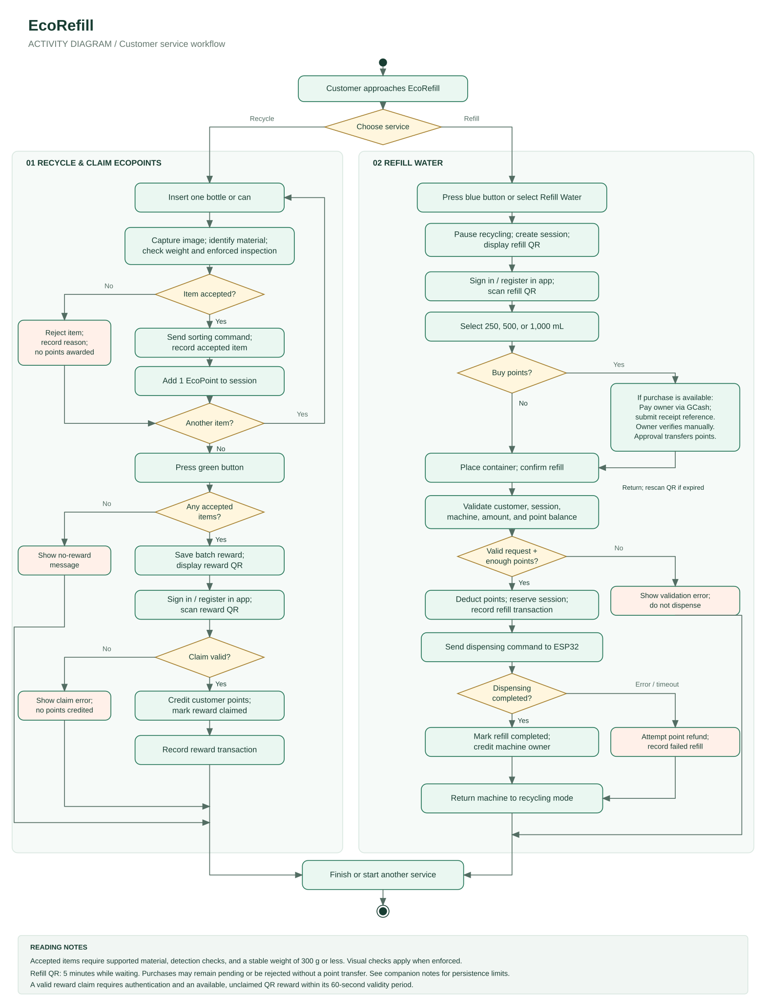
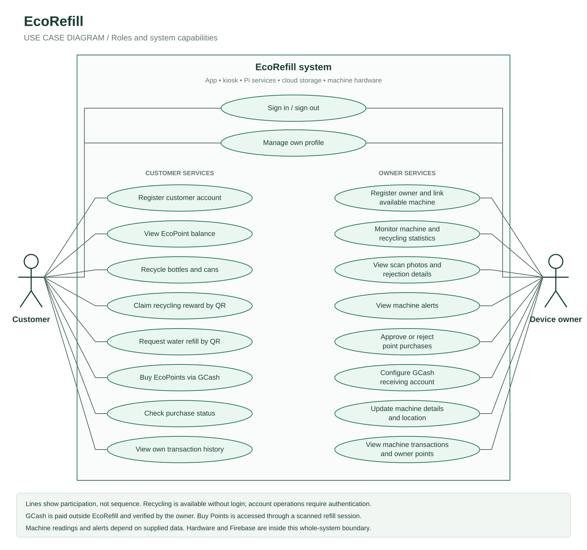

# EcoRefill system diagrams

These diagrams describe the current repository implementation. The system boundary includes the customer and owner app, kiosk, Raspberry Pi services, Firebase, and the machine hardware. The human actors are **Customer** and **Device owner**.

## Activity diagram

The activity diagram follows the two customer services: recycling items to claim EcoPoints, and spending EcoPoints on water refills. It includes the optional owner-verified GCash purchase flow and the main unsuccessful outcomes. Customer, machine, app, and owner actions are combined in this overview; the two background panels identify service alternatives, not actor swimlanes.

[Open SVG](diagrams/ecorefill-activity.svg) · [Editable PlantUML](diagrams/ecorefill-activity.puml)

## Use case diagram

The use case diagram shows each role's supported goals. Ovals are use cases, the rectangle is the system boundary, and solid lines connect actors to the use cases they participate in. A line does not indicate execution order. Sign-in and profile management are shared by both roles.

[Open SVG](diagrams/ecorefill-use-case.svg) · [Editable PlantUML](diagrams/ecorefill-use-case.puml)

## Implementation notes

- Customers can recycle without signing in at the kiosk. Signing in is required to claim rewards and submit account-based refill requests. Each accepted bottle or can adds one session point; account points are credited only after a successful reward claim.
- A recycling reward QR expires after 60 seconds. An unused waiting refill session expires after five minutes. Invalid, expired, or previously claimed reward codes cannot credit points again.
- Acceptance requires a supported material, detection thresholds, and a valid stable weight of at most 300 g. Optional visual checks affect acceptance only when enabled and enforced.
- **Buy Points** is available from the scanned refill page, even when the customer already has enough points. Creating a purchase requires an enabled owner GCash account and enough owner points. Customers pay in GCash outside EcoRefill, then submit their sender name and receipt reference. The owner manually verifies receipt. Successful approval rechecks availability and atomically transfers owner points to the customer. Rejection transfers no points and does not automatically refund GCash; insufficient owner points at approval leave the request pending. The SVG summarizes this subactivity; the PlantUML activity source expands its decisions.
- Buying points does not extend the refill session or automatically dispense water. The customer returns to refill selection and scans a new QR if needed. Invalid refill requests can be corrected and retried; the overview ends that attempt at the error outcome.
- The Pi reserves a valid refill and deducts customer points before sending a dispensing command. Confirmed successful dispensing credits the machine owner when completion is saved. A dispenser error or timeout triggers an attempted refund. Refunds and completion writes can fail if persistence fails; the diagram's normal persistence path does not imply a guaranteed refund or saved completion under every outage. The machine returns to recycling mode after dispensing succeeds or fails.
- Refill costs are intentionally omitted: the app currently displays 3 points for 250 mL, while the active Pi worker charges 2. Both use 5 points for 500 mL and 10 for 1,000 mL. This existing mismatch is documented in the project README.
- Owner monitoring shows readings and alerts supplied to the system. It does not establish that all displayed sensors are implemented. Owner registration links an existing available machine. There is no separate administrator role in the app's current routes.
- GCash is not modeled as an automatically integrated external actor, and Firebase and ESP32 are within the chosen whole-system boundary. The repository supplies the Pi-side hardware protocol; ESP32 firmware is external to the repository.

## Source references

- [Project workflows and implementation limits](../README.md)
- [Application routes](../src/App.jsx)
- [Recycling and batch reward creation](../ecorefill-pi/machine/recycling.py)
- [Authenticated reward redemption](../ecorefill-pi/machine/rewards_api.py)
- [Refill validation, dispensing, and refunds](../ecorefill-pi/machine/water_worker.py)
- [Machine owner refill points](../ecorefill-pi/machine/owner_points.py)
- [Owner-verified GCash purchases](GCASH_PAYMENTS.md)
- [Purchase creation, review, and point transfer](../ecorefill-pi/point_payments.py)

The SVGs are standalone vector images suitable for browser viewing and insertion into documents. The PlantUML files provide editable UML definitions; rendering them may produce a different layout from the hand-arranged SVGs.
