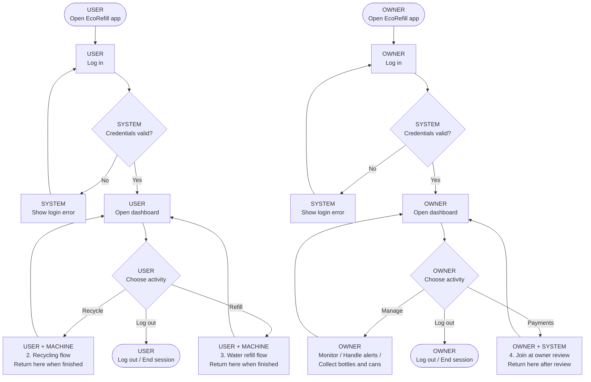
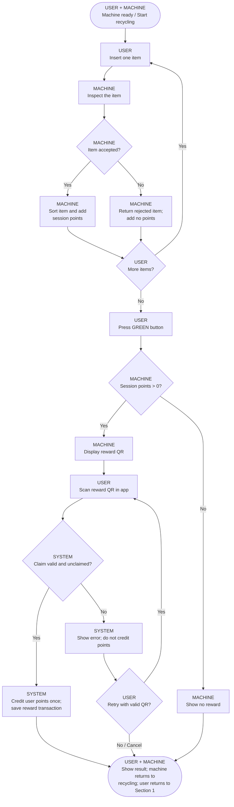
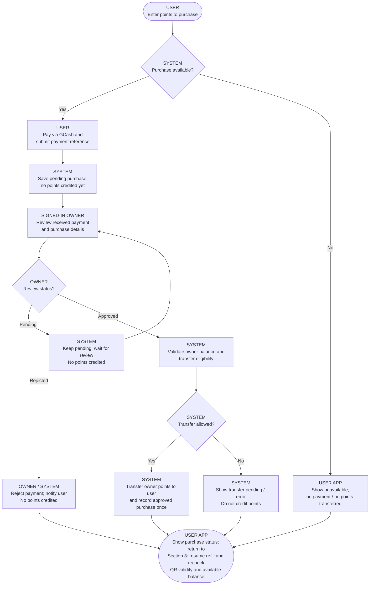

# EcoRefill — Corrected activity flow

Both users and device owners sign in. The machine has no login. The four linked sections describe one workflow; purple callouts identify the destination and return point.

Points are credited only after a valid reward claim or a verified, successfully transferred purchase. A failed refill is recorded as failed, with its actual refund status. The machine returns to recycling mode after the refill result.

## 1. Sign in and choose an activity

User and owner sessions are independent. Machine operation does not require an owner to be logged in.



## 2. Recycle items and claim points

Entry: signed-in user chooses recycling. Accepted and rejected items both finish inspection before the next-item decision.



## 3. Select, pay for, and dispense water

Entry: signed-in user chooses refill. Payment approval adds points; only a validated refill request can start dispensing.

```mermaid
flowchart TD
    blue["USER<br/>Press BLUE button / Select refill"]
    qr["MACHINE<br/>Create refill session; display QR"]
    selection["USER<br/>Scan valid refill QR;<br/>select water amount"]
    confirm["USER<br/>Place container and<br/>confirm refill request"]
    validate["SYSTEM / MACHINE<br/>Validate session, amount,<br/>balance and machine availability"]
    reserve["SYSTEM<br/>Reserve refill and<br/>deduct points atomically"]
    dispense["MACHINE<br/>Dispense water; monitor container"]
    success["SYSTEM<br/>Save completed refill"]
    result["USER APP<br/>Show actual refill / refund result"]
    reset["MACHINE<br/>Return machine to recycling mode"]
    balance{"USER APP<br/>Enough points?"}
    buy{"USER<br/>Buy points?"}
    purchase["USER + OWNER<br/>4. Point purchase flow<br/>Return with purchase status"]
    resume["USER<br/>Resume refill; scan new QR<br/>if the session expired"]
    cancelbuy["USER<br/>Cancel refill"]
    valid{"SYSTEM / MACHINE<br/>Refill request valid?"}
    invalid["SYSTEM<br/>Show reason; no deduction<br/>and no dispensing"]
    retryrefill{"USER<br/>Retry refill?"}
    complete{"MACHINE<br/>Dispensing complete?"}
    stop["MACHINE<br/>Stop dispensing on<br/>error or timeout"]
    refund["SYSTEM<br/>Attempt refund of deducted points"]
    refunded{"SYSTEM<br/>Refund successful?"}
    refundok["SYSTEM<br/>Record failed refill<br/>and successful refund"]
    refundpending["SYSTEM<br/>Record failed refill;<br/>refund unresolved"]
    end(["USER<br/>Return to user dashboard<br/>Section 1"])
    blue --> qr
    qr --> selection
    selection --> balance
    confirm --> validate
    validate --> valid
    reserve --> dispense
    dispense --> complete
    success --> result
    result --> reset
    reset --> end
    purchase --> resume
    stop --> refund
    refund --> refunded
    balance -->|"Yes"| confirm
    balance -->|"No"| buy
    buy -->|"Yes"| purchase
    buy -->|"No"| cancelbuy
    resume -->|"Recheck QR and balance"| selection
    cancelbuy --> reset
    valid -->|"Yes"| reserve
    valid -->|"No"| invalid
    invalid --> retryrefill
    retryrefill -->|"Yes"| blue
    retryrefill -->|"No / Cancel"| reset
    complete -->|"Yes"| success
    complete -->|"No"| stop
    refunded -->|"Yes"| refundok
    refunded -->|"No"| refundpending
    refundok --> result
    refundpending --> result
```

## 4. Buy points and verify payment

Called from the refill selection page. The signed-in owner reviews purchases in Transactions; records do not replace owner login.


